## VALERIAN KALEB SETIAWIRAWAN---FINAL-PROJECT-OS-SERVER-&-SYSTEM-ADMIN---23.83.0965
# Judul : Prediksi Polusi Udara Menggunakan Machine Learning


Repository ini berisi Dokumentasi langkah-langkah membuat machine learning untuk memprediksi apakah polusi udara termasuk aman atau berbahaya dengan menginputkan data secara manual.

Progress:
- 3 December 2024: Penentuan tema
- 6 December 2024: Penyelesaian
- 8 December 2024: Pembuatan Web Simulasi

## Daftar Isi
1. [Instalasi dan Konfigurasi SSH](#1-instalasi-dan-konfigurasi-ssh-server)
2. [Instalasi dan Konfigurasi DHCP Server](#2-instalasi-dan-konfigurasi-dhcp-server)
3. [Instalasi dan Konfigurasi Database Server](#3-instalasi-dan-konfigurasi-database-server)
4. [Instalasi dan Konfigurasi Web Server](#4-instalasi-dan-konfigurasi-web-server)
5. [Instalasi dan Konfigurasi DNS Server](#5-instalasi-dan-konfigurasi-dns-server)
   

## Langkah 1: Mencari data
Data yang akan kita pakai adalah Dataset yang berfokus pada penilaian kualitas udara di berbagai wilayah. Anda cukup menuju halaman kaggle berikut dan mengunduh data gratis.

[Dataset Kaggle air-quality-and-pollution-assessment](https://www.kaggle.com/datasets/mujtabamatin/air-quality-and-pollution-assessment)

## Langkah 2: Memahami Permasalahan
Jenis machine learning pada project ini merupakan supervised learning, karena data memiliki label. Label dalam dataframe ini adalah data yang dimuat pada Air Quality. Selain itu, data yang kita miliki merupakan structured data karena data tersebut berwujud tabel.

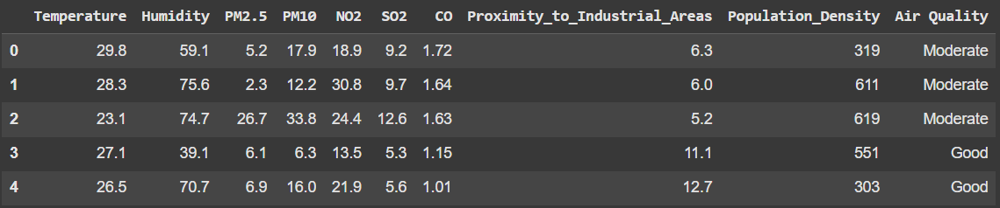

Sedangkan permasalahan yang kita miliki merupakan classification, dimana kita akan membuat machine learning model untuk memprediksi tingkat berbahaya polusi udara yang ada di lingkungan menurut data yang diberikan. Data yang diberikan tersebut adalah Suhu, Kelembapan, PM(Particulate Matter) atau Partikel Udara, Nitrogen Dioksida(NO2), Sulfur Dioksida(SO2), Karbon Monoksida(CO), Proximitas ke Kawasan Industri, dan Kepadatan Penduduk. Sesuai dengan dataframe yang kita miliki, kolom Air Classification adalah label dan kolom lainnya adalah data. Baik data maupun label akan diberikan kepada machine learning model untuk dipelajari.

## Langkah 3: Menganalisis dan Memproses Data
### 3.1 Overview Data
Buatlah notebook baru, import beberapa library yang diperlukan. Muatlah data ke dalam notebook dengan Pandas.

```
# Import standard library
import pandas as pd
import numpy as np
import matplotlib.pyplot as plt
import seaborn as sns

# Memuat file laliga.csv menjadi pandas dataframe
dataframe = pd.read_csv('/content/airquality.csv')
dataframe.head()
```


### 3.2 Mengubah Data Menjadi Numerik
Setelah kita berhasil memuat data ke dalam program, proses selanjutnya ialah memproses data dan mengubahnya menjadi numerik atau angka. Namun, sebelumnya Anda harus mengetahui tipe data dalam dataframe.
```
# Menampilkan informasi dari dataframe
dataframe.info()
```

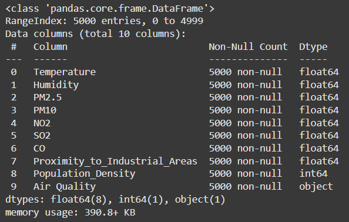

Pada kolom Dtype terdapat banyak jenis data yang berbeda beda, yaitu int64, float64 dan object. Data dengan tipe objek ini merupakan categorical data, sehingga setelah ini harus dilakukan preprocessing untuk mengubah data menjadi numerik atau angka. Karena komputer hanya dapat membaca data yang berupa angka.

Caranya, kita dapat menggunakan encoder dari module Sklearn. Encoder digunakan untuk mengubah data kategori menjadi angka.
```
# Import LabelEncoder dari module sklearn
from sklearn.preprocessing import LabelEncoder

# Menyalin / copy dataframe agar dataframe awal tetap utuh
dataframe_int = dataframe.copy()

# Membuat objek/instance yang bernama encoder
encoder = LabelEncoder()

# Membuat list dari nama kolom data kategori
categorical_data = ['Air Quality']

# Mengubah setiap data kategori menjadi numerik dengan encoder
for kolom in categorical_data:
    dataframe_int[kolom] = encoder.fit_transform(dataframe[kolom])

# Sekarang data sudah berupa angka sepenuhnya
dataframe_int.head()
```

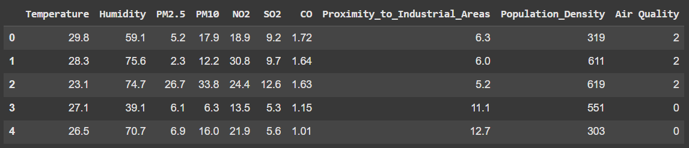

### 3.3 Mengubah Data Menjadi Numerik
Proses dilanjutkan dengan menganalisis data kategori. Dimulai dengan mencari tahu jumlah kelas yang dimiliki oleh setiap categorical data

```
for kolom in categorical_data:
    print(f'Kolom, {dataframe_int[kolom].unique()}')

for kolom in categorical_data:
    print(f'Kolom, {dataframe[kolom].unique()}')
```

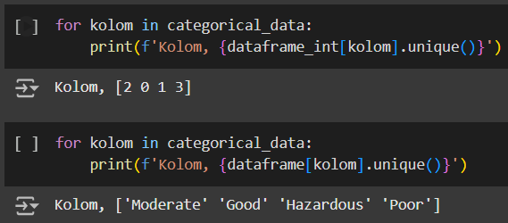

Terdapat 4 kelas, yaitu 'Moderate' 'Good' 'Hazardous' 'Poor'. Sehingga bisa kita menyimpulkan bahwa permasalahan ini merupakan multi-class classification dimana kita melakukan klasifikasi data yang memiliki jumlah kelas lebih dari dua.

Sekarang, kita dapat menganalisa bahwa nama kelas yang semula kata kata digantikan oleh angka. Angka tersebut mewakili kelas masing masing. Terdapat 4 kelas yaitu 2,0,1, dan 3. Dimana 0 mewakili Good, 3 mewakili poor, 1 mewakili Hazardous, dan 2 mewakili Moderate. Begitu juga dengan kolom yang lain. Ini adalah apa yang terjadi saat kita menggunakan LabelEncoder().

### 3.4 Analisis Matrix Korelasi
Proses masih berada pada analisis data, sekarang kita melakukan analisis pada matrix korelasi. Dimana matrix korelasi memberikan kita informasi mengenai korelasi atau hubungan kolom satu dengan kolom yang lain.
```
# Menampilkan matrix korelasi antar Kolom
dataframe_int.corr()
```

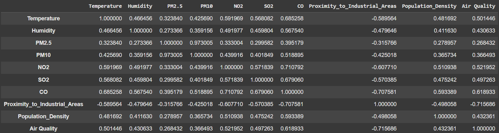

Data yang memiliki hubungan satu sama lain adalah data yang penting, karena akan mempengaruhi proses latihan dan akurasi model. Adapun cara untuk mengetahui data mana yang penting adalah dengan menganalisa nilai korelasinya. Untuk mempermudah proses analisa, maka dapat dilakukan dengan visualisasi data.
```
plt.figure(figsize=(10,8))
plt.title('Matrix Korelasi Data')
sns.heatmap(dataframe_int.corr(),annot=True,linewidths=3)
plt.show()
```

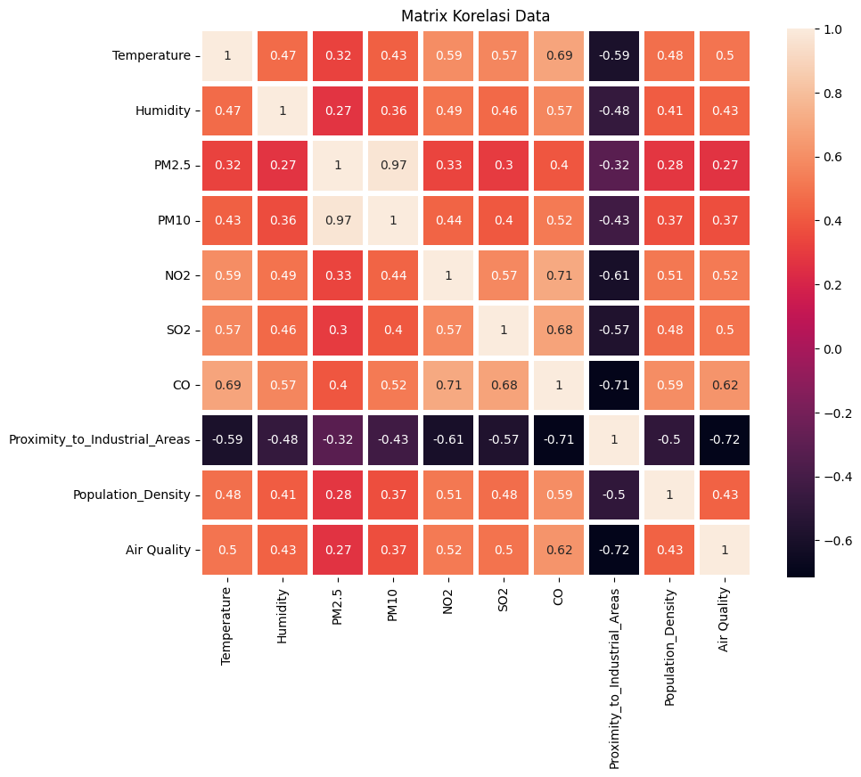

Nilai korelasi berkisar pada jarak -1 sampai 1. Jika bernilai negatif maka data memiliki korelasi negatif, dan sebaliknya. Namun, jika nilai korelasi mendekati nol, artinya data tersebut hampir tidak memiliki korelasi atau korelasinya rendah, sehingga data tersebut bukan merupakan data yang penting. Artinya, data tersebut akan mengganggu akurasi model.

### 3.5 Distribusi Data
Distribusi data adalah sebuah data yang dapat memberitahu kita semua nilai data dan setiap frekuensi yang dimiliki dalam dataframe. Untuk mengetahui distribusi dalam data, dapat dilakukan dengan membuat visualisasi sebuah histogram.
```
def distribusi():
    fig,axes = plt.subplots(nrows=2,ncols=5,figsize=(15,8))
    plt.suptitle('Distribusi',fontsize=18)

    def kolom_generator():
        for kolom in dataframe_int:
            yield kolom
    kolom = kolom_generator()

    for i in range(0,2):
        for j in range(0,5):
            k = next(kolom)
            dataframe_int[k].plot(kind='hist',ax=axes[i,j])
            axes[i,j].set_title(k)
    plt.show()

distribusi()
```

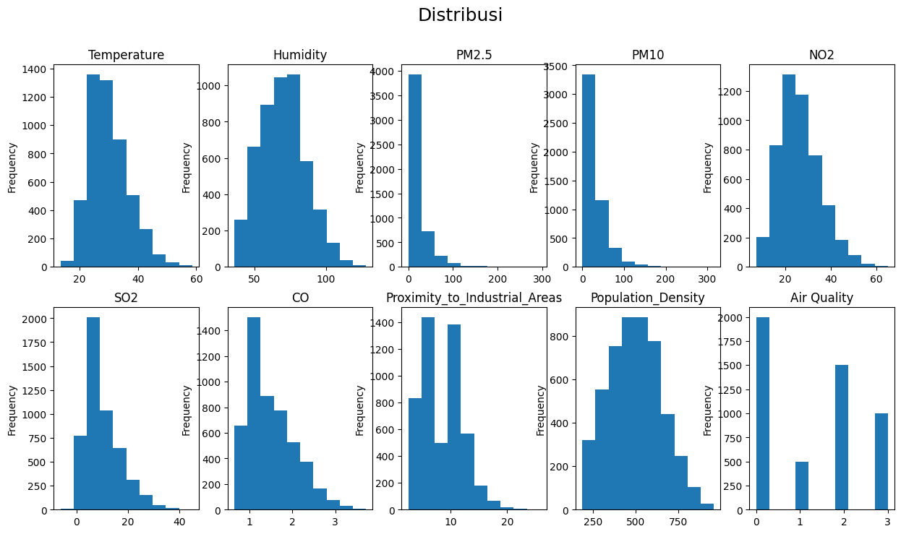

### 3.6 Memisahkan Data
Dataframe harus dibagi menjadi dua, yaitu data dan label. Label merupakan kolom Air Quality yang ingin diprediksi, sedangkan data merupakan kolom lainnya. Setelah kita memiliki data dan label, maka kita pisahkan menjadi dua sekali lagi menjadi latihan dan tes.
```
from sklearn.impute import SimpleImputer

# Memisahkan dataframe awal menjadi data dan label
data = dataframe_int.drop('Air Quality', axis=1)
label = dataframe_int['Air Quality']

# Memisahkan dataframe menjadi data latihan dan data tes
from sklearn.model_selection import train_test_split
x_train, x_test, y_train, y_test = train_test_split(data, label, test_size=0.2, random_state=42)

# Buat imputer untuk mengisi nilai NaN dengan rata-rata
imputer = SimpleImputer(strategy='mean')

# Pasangkan imputer pada data pelatihan dan ubah data pelatihan dan pengujian
x_train = imputer.fit_transform(x_train)
x_test = imputer.transform(x_test)
```
Data latihan digunakan sebagai bahan latihan model, sementara data tes digunakan untuk menguji performa model sebelum digunakan untuk bekerja. Sehingga sekarang kita memiliki empat data yaitu data latihan (x_train), data test (x_test), label latihan (y_train) dan label tes (y_test).

Kita import train_test_split dari sklearn.model_selection dimana kita memberikan parameter yaitu data, label, dan test size.

## Langkah 4: Membuat Machine Learning Model
Dengan library sklearn, sudah terdapat banyak machine learning model yang siap dipakai. Kita hanya perlu menentukan model mana yang tepat untuk masalah yang kita miliki. Model, disebut juga dengan estimator atau algoritma.

Samples (data) yang kita miliki lebih dari 50, yaitu 5000 dan kita akan memprediksi kategori yang memiliki label (supervised classification problem), maka kita masuk ke bagian classification model. Data yang kita miliki kurang dari 100 ribu maka model/estimator/algoritma yang akan kita gunakan adalah Linear SVC.
```
# Import linear SVC model dari sklearn
from sklearn.metrics import r2_score, classification_report
from sklearn.svm import SVC

# Membuat objek dengan nama "model" dengan memanggil SVC()
model = SVC(gamma='scale')
```
Terdapat parameter gamma pada SVC(), namun untuk saat ini Anda tidak perlu khawatir dengan hal tersebut, ikuti saja prosesnya terlebih dahulu karena nanti akan dibahas lebih lanjut pada bagian peningkatan model.

## Langkah 5: Melatih Machine Learning Model
Setelah kita memiliki model yang tepat, selanjutnya kita melatih model terhadap data latihan yang kita miliki.
```
# Melatih model dengan data latihan
model.fit(x_train,y_train)
```
Setelah model selesai latihan, sekarang saatnya untuk menguji latihannya, dengan cara menggunakan model untuk memprediksi data tes.
```
# Membuat prediksi terhadap data tes
prediction = model.predict(x_test)
```
Sekarang kita memiliki hasil prediksi yang berupa numpy array. Model memprediksi data dalam x_test yaitu Suhu, Kelembapan, PM2.5, PM10, NO2, SO2, CO, Proximitas ke Kawasan Industri, dan Kepadatan Penduduk. Sedangkan hasil prediksinya yaitu jenis Kualitas Udara, dimana kita memiliki 4 jenis Kualitas Udara.

## Langkah 6: Evaluasi Model
Sekarang kita telah memiliki machine learning model dan model tersebut dapat digunakan untuk memprediksi data tes, namun kita harus menganalisa performa model dan melakukan evaluasi. Caranya adalah dengan membaca error metrics.

Error metrics setiap permasalahan berbeda beda, untuk permasalahan classification terdapat accuracy_score, precision, recall, f1-score, r2_score dan confusion matrix. Untuk accuracy_score, precision, recall, dan f1-score dapat diakses dengan satu fungsi saja yaitu classification_report.

### 6.1 Analisa Confusion Matrix
confusion_matrix() akan me-return dataframe. Daripada menganalisa data dari tabel maka lebih mudah jika dilakukan visualisasi. Maka kita gunakan heatmap dari seaborn. Seperti biasa, untuk mempermudah proses analisa, dapat dilakukan dengan visualisasi data.
```
# Import confusion matrix dari sklearn
from sklearn.metrics import confusion_matrix

# Membuat funsi untuk menampilkan confusion matrix dengan seaborn dan matplotlib
def display_conf(y_test,prediction):
    sns.heatmap(confusion_matrix(y_test,prediction),annot=True,linewidths=3,cbar=False)
    plt.title('Confusion Matrix')
    plt.ylabel('Actual')
    plt.xlabel('Prediction')
    plt.show()

# Memanggil fungsi untuk menampilkan visualisasi confusion matrix
display_conf(y_test,prediction)
```

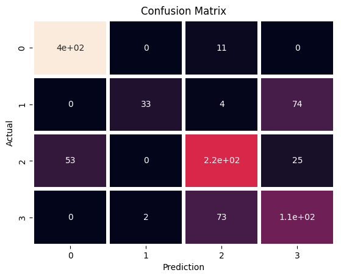

Dengan memvisualisasikan confusion matrix, kita tidak hanya tau apakah prediksi benar atau salah, namun juga mengerti dimana letak kesalahannya. Nilai pada setiap kotak adalah jumlah kelas yang diprediksi. Karena kita memiliki 4 kelas, maka bentuk dari confusion matrix adalah 4x4.

Prediksi dikatakan benar jika nilai aktual kelas 0 dan prediksi kelas 0, begitu juga dengan kelas 1,2 dan lainnya. Maka model yang baik akan menghasilkan visualisasi confusion matrix yang berbentuk matrix diagonal dari kiri atas ke kanan bawah.

Karena kita baru saja membuat model maka hasilnya model banyak membuat kesalahan prediksi. 

### 6.2 Analisa Error Metrics
Pada classification report terdapat precision, recall, f1-score dan support. Masing masing matrix tersebut dihitung berdasarkan confusion matrix. kali ini kita fokus saja pada r2_score, accuracy_score dan precission.
```
print(f'R2 Score : {r2_score(y_test,prediction)}')
print('Classification Report :')
print(classification_report(y_test,prediction,zero_division=0,))
```

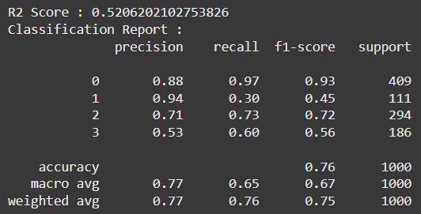

R2_score adalah sebuah nilai yang menyatakan seberapa sesuai hasil prediksi model mendekati data yang sebenarnya. Semakin besar r2_score, maka hasil prediksi semakin dekat dengan data yang sebenarnya. Semakin besar r2_score maka model semakin bagus. Nilai maksimum untuk r2_score, accuracy_score, dan precission adalah 1.00 yaitu 100% dan tidak ada nilai negatif.

Semakin besar nilai akurasi maka semakin bagus model yang kita miliki. Sedangkan presisi adalah sebuah nilai yang menyatakan rasio akurasi model. Semakin besar nilai presisi maka semakin bagus model yang kita miliki.

Data yang kita miliki memiliki frekuensi yang tidak seimbang pada setiap kelasnya, maka nilai akurasi tidak benar benar membuktikan kualitas model yang kita buat, maka kita juga perhatikan nilai presisi setiap kelas, khususnya pada kelas 1 yang memiliki frekuensi data rendah.

## Langkah 7: Meningkatkan Model
Setelah kita berhasil membuat model yang dapat bekeerja, kita harus meningkatkan kualitasnya untuk mengatasi perbedaan frekuensi setiap kelasnya.

Diantaranya adalah dengan menambah jumlah data, menggunakan teknik preprocessing data yang tepat, memilih machine learning model yang lebih tepat, tuning hyperparameter model, cross validation, dsb. Kali ini kita akan melakukan tuning hyperparameter dan menerapkan cross validation. Untuk melakukannya kita dapat menggunakan grid search cv.
```
# Menggunakan GridSearchCV untuk menemukan model dengan parameter terbaik
import warnings
from sklearn.model_selection import GridSearchCV

# SVC Model Hyperparameter
param_grid = {'C':[0.01,0.1,1,10,100],
              'gamma':[100,10,1,0,1,0.01]}

# Membuat model terbaik dari semua kemungkinan kombinasi param_grid
with warnings.catch_warnings():
    warnings.filterwarnings("ignore", message="The least populated class in y has only 1 members")

    best_model = GridSearchCV(SVC(),param_grid,cv=5,refit=True)

    # Melatih model terbaik
    best_model.fit(x_train,y_train)

# Model dengan parameter terbaik
best_model.best_estimator_
```
Di dalam param_grid terdapat C dan gamma yang merupakan parameter yang dimiliki oleh estimator SVC. Sedangkan cv=5 artinya kita akan melatih model dengan 5 lipatan, dan untuk refit = True adalah untuk mengambil model dengan paramter yang terbaik setelah semua model selesai berlatih.

Jadi pada tahap ini dibuatlah banyak model dengan konfigurasi parameter yang berbeda beda sebanyak kombinasi yang memungkinkan dari param_grid, kemudian diambil satu diantarannya yang terbaik. Itulah maksud dari tuning hyperparameter. 

Kita dapat mengetahui bahwa model terbaik memiliki parameter C=10 dan gamma = 0.01. Sekarang saatnya untuk membuat prediksi dan melakukan evaluasi terhadap model terbaik yang kita buat.
```
# Membuat prediksi dengan model yang telah ditingkatkan
prediction = best_model.predict(x_test)

# Menampilkan confusion matrix pada prediksi yang baru
display_conf(y_test,prediction)
```

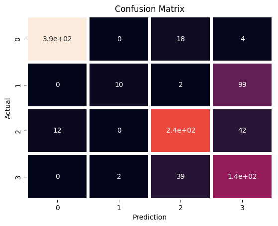

```
print(f'R2 Score : {r2_score(y_test,prediction)}')
print('Classification Report :')
print(classification_report(y_test,prediction,zero_division=0,))
```

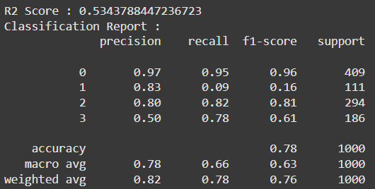

## Langkah 8: Menyimpan Machine Learning Model
Anda dapat menyimpan machine learning model, sehingga Anda dapat menggunakannya untuk melakukan prediksi data di waktu dan program atau script yang berbeda tanpa melatih model dan melakukan semua proses dari awal. Untuk melakukan hal ini, Anda dapat menggunakan library pickle.
```
import pickle
# Menyimpan model menjadi file .pkl
with open('AI_AirClassifier.pkl','wb') as file:
    pickle.dump(best_model,file)
```
Sekarang Anda memiliki model yang dapat ditransfer, dicopy dan dimuat dalam script yang berbeda. Untuk memuat model di script yang berbeda, dapat dilakukan dengan cara berikut.
```
with open('AI_AirClassifier.pkl','rb') as file:
    model = pickle.load(file)
```

## Langkah 9: Demonstrasi Model
```
# Demonstrasi Prediksi Model
import pickle

with open('AI_AirClassifier.pkl','rb') as file:
    model = pickle.load(file)

def self_prediction():
    Temperature = float(input('Suhu : '))
    Humidity = float(input('Kelembapan : '))
    PM25 = float(input('PM2.5 : '))
    PM10 = float(input('PM10 : '))
    NO2 = float(input('NO2 : '))
    SO2 = float(input('SO2 : '))
    CO = float(input('CO : '))
    Proximity_to_Industrial_Areas = float(input('Proximitas ke Kawasan Industri : '))
    Population_Density = float(input('Kepadatan Penduduk : '))

    # data harus berbentuk (1,9) yaitu [[Temperature,Humidity,PM2.5,PM10,NO2,SO2,CO,Proximity_to_Industrial_Areas,Population_Density]]
    print('\nPrediction')
    # Melakukan prediksi dan menampilkan hasilnya
    prediction = model.predict([[Temperature, Humidity, PM25, PM10, NO2, SO2, CO, Proximity_to_Industrial_Areas, Population_Density]])[0]
    print('Kualitas Udara : ', encoder.inverse_transform([prediction])[0])

# Jalankan fungsi untuk demonstrasi
self_prediction()
```

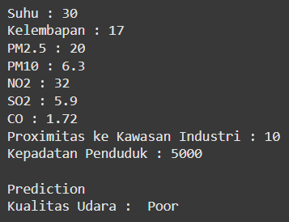

## Tampilan Website Simulasi
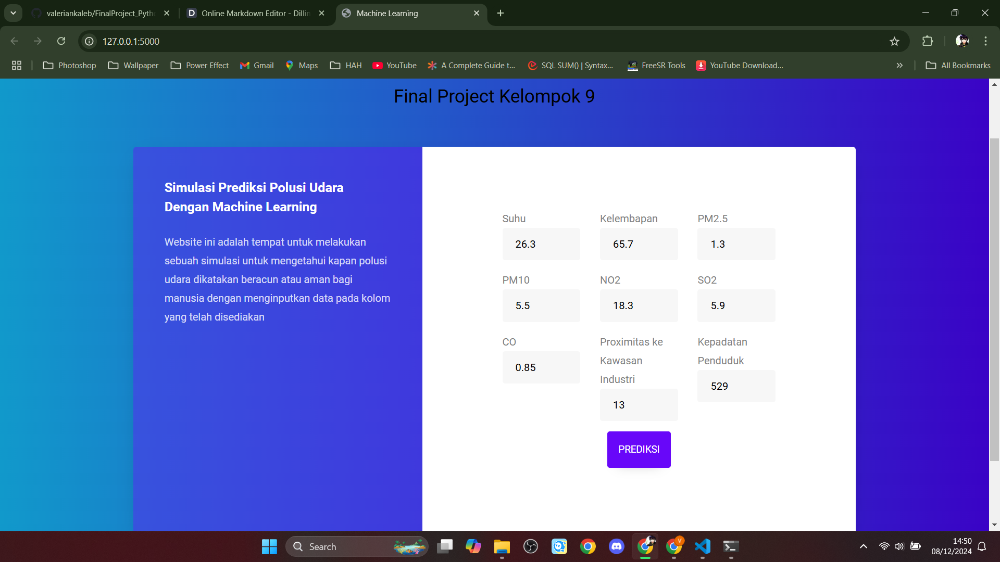
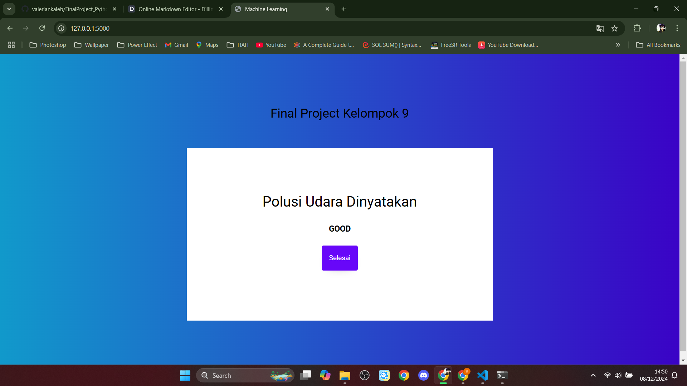